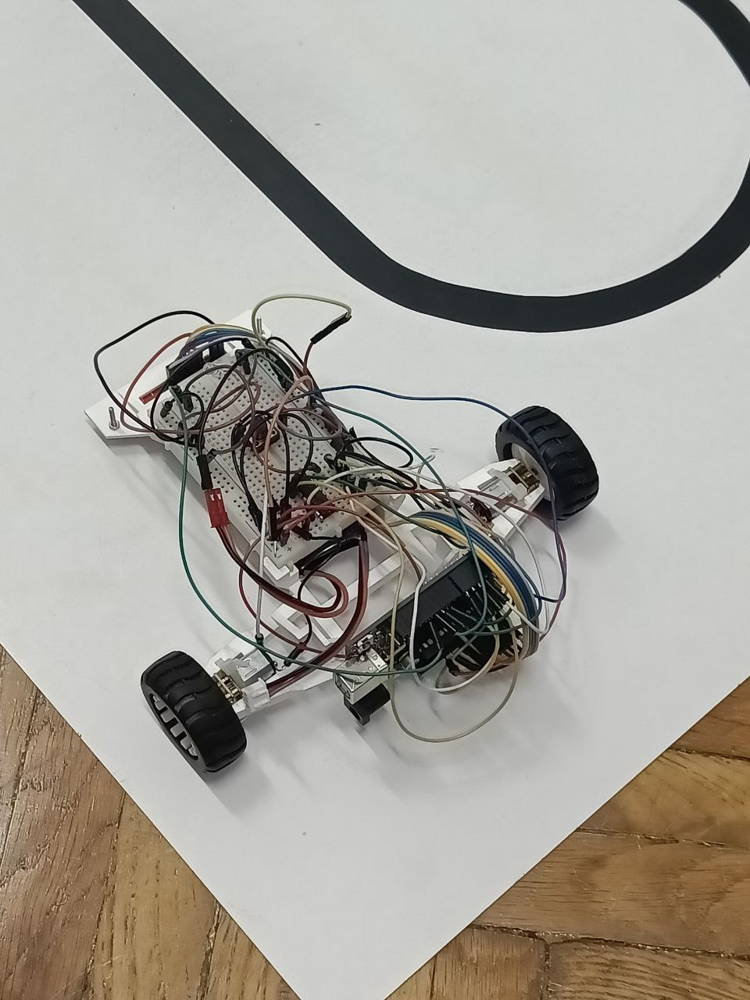
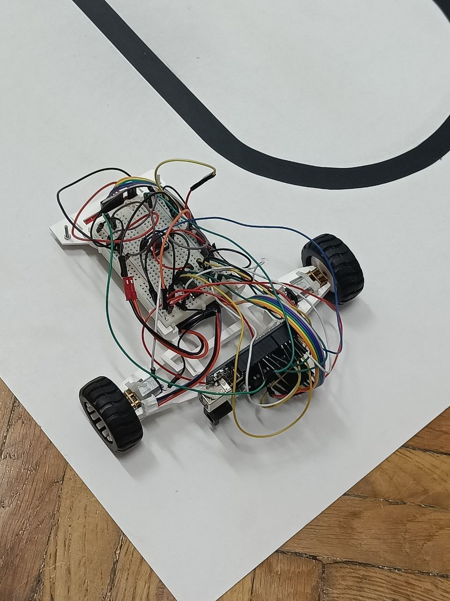
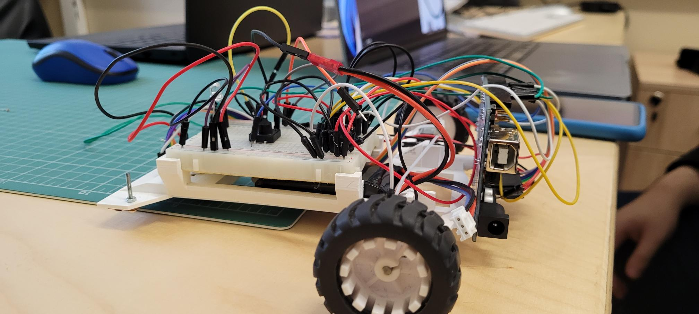

# Line follower project

## 📒 Description 📖

Project created as part of the "Introduction to Robotics" course I took in the 3rd year at the Faculty of Mathematics and Computer Science, University of Bucharest. The goal was to create a "car"-like robot to follow a black line on a white route. The goal of the robot was to follow the line as fast as possible, without deviating from the line or changing the route on curves.

We build the "car"-like robot at the laboratory.
We participated in the organized hackathon, along other students to see who can build the best line follower robot. Ath the hackaton we made the robot auto-calibrate himself. After that, we meet the following week to adjust the pid values (we didn't use the I component).

👥 We participated as the Team Tindra. My teammate was Sasa Neacsu.\
Teammate repo - [here](https://github.com/NSA-25/Line_Follower)

## 🧰 Components used 🛠️

⚙️ Arduino Uno - 1\
⚙️ Chassis - 1\
⚙️ A power source (LiPo battery) - 1\
⚙️ QTR-8A reflectance sensor (we used only 6 of them) - 1\
⚙️ Screws - 2\
⚙️ Ball caster (insted of front wheels) - 1\
⚙️ Small breadboard - 1\
⚙️ L293D motor driver - 1\
⚙️ DC motors - 2\
⚙️ Zip ties - 4\
⚙️ Wheels - 2 (paced in the back, it's RWD)\
⚙️ Wires - lots of them :)\
⚙️ White led - 1

## 🖼️ Pictures of the setup

## 🎥 Video showcasing the setup

